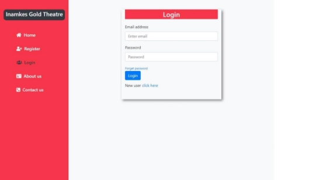
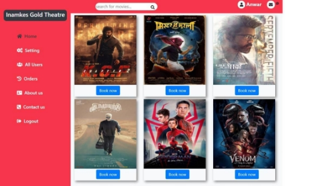
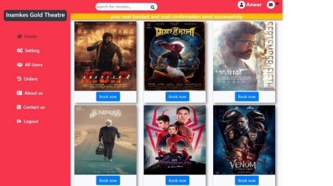
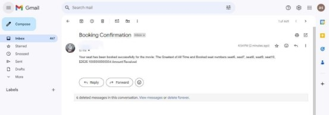

**Project Overview:** Film Ticket Booking Project 
**Project Title:** Film Ticket Booking Project

**Objective:**

The Film Ticket Booking application is an online platform designed to simplify the process of reserving movie tickets. Built using the Spring Boot framework, it offers users a seamless and efficient experience from selecting movies and showtimes to booking tickets and receiving confirmation emails.

**Key Features:**

- **Booking Management:** Users can browse available movies, choose showtimes, and book tickets effortlessly.
- **Automated Confirmation:** Once a booking is made, a JMS-based messaging system handles the asynchronous processing of the booking data. A confirmation email containing booking details is automatically sent to the customer using JavaMailSender.
- **Database Integration:** The application uses MySQL as the backend database to store booking details securely, while JPA and Hibernate are used to ensure smooth interaction between the database and the application.
- **Error Handling:** Implemented robust error-handling mechanisms to ensure reliable delivery of confirmation emails and smooth application performance.
- **Responsive Design:** The user interface is designed to be intuitive and user- friendly, ensuring a smooth experience across devices.

**Technologies Used:**

- **Spring Boot:** Application framework
- **JMS (Java Message Service):** For reliable messaging
- **JavaMailSender:** For sending booking confirmation emails
- **MySQL:** Database for storing booking information
- **JPA & Hibernate:** For ORM and efficient database handling
- **Web Servers:** To deploy and run the web application

**Impact:**

- Ensured a reliable and user-friendly booking process, leading to increased customer satisfaction and reduced errors in bookings.
- The use of JMS and email automation streamlined communication, ensuring timely notifications for users.

**Project Images:** Index page

Signup page

Login page:![ref1]

After login home page![ref1]

Seat selection page:

Success message

User info page:![ref1]

Order history page:

Confirmation mail:

**Conclusion:**

The Film Ticket Booking project successfully streamlined the movie ticket reservation process, providing users with a seamless experience from booking to confirmation. By integrating key technologies such as Spring Boot, JMS, and JavaMailSender, the application achieved reliable asynchronous communication and automated email notifications. The use of MySQL, JPA, and Hibernate ensured efficient data management, while the intuitive, responsive UI enhanced the overall user experience. The project not only improved operational efficiency but also elevated customer satisfaction through timely and accurate booking confirmations.

[ref1]: ./readme_images/Aspose.Words.52065dba-75af-4556-93ff-bdd0aba0b288.004.png
